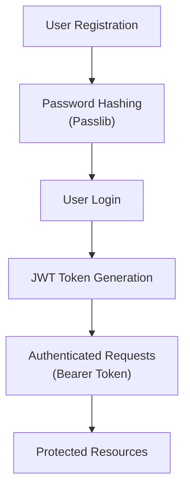
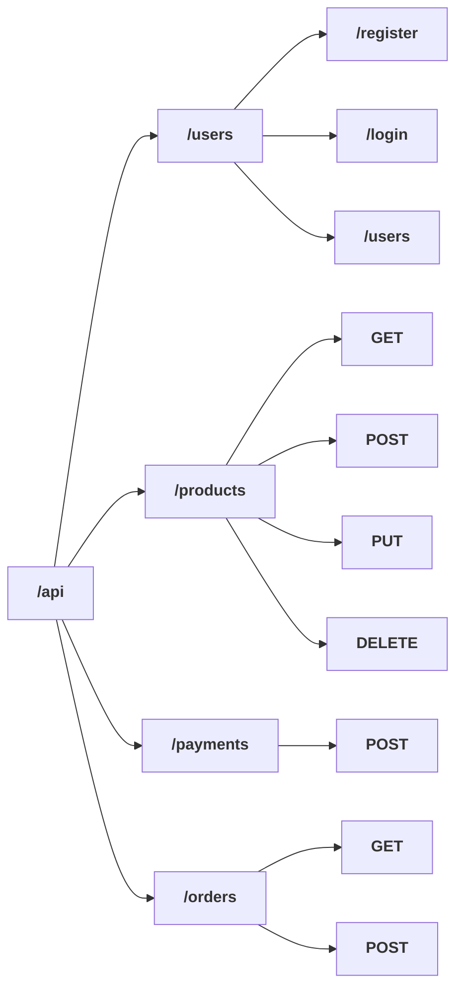
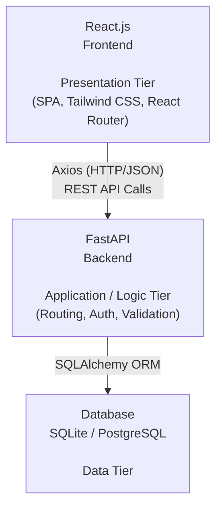

# 🛍️ Drop — Modern E-commerce Platform

Drop is a modern and scalable e-commerce platform designed to provide a seamless online shopping experience. Built with a responsive React.js frontend and a powerful FastAPI backend, the platform focuses on clean UI, efficient product management, secure authentication, shopping cart functionality, and a scalable architecture for future ecommerce features.

---

## ✨ Features

- 🛍️ Modern Product Browsing & Discovery
- 👕 Clothing & Fashion Product Catalog
- 🔎 Product Search & Filtering
- 📦 Detailed Product Information
- 🛒 Shopping Cart Management
- ❤️ Wishlist / Favorite Products
- 👤 User Registration & Authentication
- 🔐 JWT-based Authentication
- 💳 Payment-ready Checkout Architecture
- 📍 Shipping & Delivery Information
- ⭐ Product Reviews & Ratings
- 📱 Fully Responsive Design
- 🎨 Modern UI built with Tailwind CSS
- ⚡ Fast Frontend with React & Vite
- 🚀 High-performance REST API with FastAPI
- 🗄️ Database Integration with SQLAlchemy
- 🏗️ Scalable Frontend & Backend Architecture

---

## 🛠️ Tech Stack

### Frontend

- React.js
- Vite
- Tailwind CSS
- React Router DOM
- Axios
- React Icons


### Backend

- FastAPI
- Python
- SQLAlchemy
- Pydantic
- JWT Authentication
- Passlib / Password Hashing
- Uvicorn

### Development Tools

- Git
- GitHub
- Visual Studio Code

---

## 📥 Clone Repository

```
git clone https://github.com/Neeschal1/Drop.git
```

---

# ⚙️ Installation

## 1. Navigate to the Project

```
cd Drop
```

---

## 2. Setup Frontend

Navigate to the frontend directory:

```
cd client
```

Install the dependencies:

```
npm install
```

Start the development server:

```
npm run dev
```

The frontend will be available at:

```
http://localhost:5173
```

---

## 3. Setup Backend

Open a new terminal and navigate to the server directory:

```
cd server
```

Create a virtual environment:

### Windows

```
python -m venv venv
```

Activate the virtual environment:

```
venv\Scripts\activate
```

### Linux / macOS

```
python3 -m venv venv
source venv/bin/activate
```

Install the backend dependencies:

```
pip install -r requirements.txt
```

Start the FastAPI server:

```
uvicorn main:app --reload
```

The backend API will be available at:

```
http://127.0.0.1:8000
```

---

# 📖 API Documentation

FastAPI provides automatic interactive API documentation.

### Swagger UI

```
http://127.0.0.1:8000/docs
```

### ReDoc

```
http://127.0.0.1:8000/redoc
```

---

# 🔐 Authentication

Drop uses **JWT-based authentication** to protect user-specific resources and API endpoints.

The authentication system includes:

- User Registration
- User Login
- Password Hashing
- JWT Access Tokens
- Protected API Routes
- Authenticated User Operations

### Authentication Flow


---

# 🛒 E-commerce Functionality

## 👕 Products

Users can browse products and view detailed information such as:

- Product name
- Product description
- Product images
- Product price
- Available sizes
- Product category
- Product details

---

## 🛍️ Shopping Cart

Users can:

- Add products to the cart
- Select product sizes
- Adjust product quantities
- Remove products
- View cart items
- Calculate cart totals

---

## ❤️ Wishlist

Users can save products to their wishlist and manage their favorite products for future purchases.

---

## 👤 User Accounts

Users can:

- Create an account
- Log in securely
- Access authenticated resources
- Manage their account information

---

## 💳 Checkout

The backend provides a structured checkout system supporting information such as:

- Customer name
- Email address
- Shipping address
- City
- Postal code
- Payment method
- Product information
- Quantity
- Cost

---

# 🔌 API Architecture

The backend is built using **FastAPI** and follows a RESTful API architecture.

Example API structure:



---

# 🧩 Application Architecture

Drop follows a separated frontend and backend architecture:


This architecture keeps the frontend and backend independent, making the application easier to maintain, test, deploy, and scale.

---

# 📦 Production Build

## Frontend

Navigate to the client directory:

```
cd client
```

Create a production build:

```
npm run build
```

Preview the production build:

```
npm run preview
```

---

## Backend

Run the FastAPI application:

```
uvicorn main:app --host 0.0.0.0 --port 8000
```

---

# 🚀 Upcoming Features

- 🏪 Seller / Vendor Accounts
- 📦 Advanced Order Management
- 💳 Online Payment Gateway Integration
- 🚚 Order Tracking
- 📧 Email Notifications
- 📱 User Dashboard
- 👨‍💼 Admin Dashboard
- 📊 Sales & Analytics Dashboard
- ⭐ Advanced Review & Rating System
- 🔎 Advanced Product Search
- 🏷️ Discount & Coupon System
- 📦 Inventory Management
- 🔔 Real-time Notifications
- 🤖 AI-powered Product Recommendations
- 🧠 Personalized Shopping Experience
- ☁️ Cloud-based Image Storage
- 🚀 Production Deployment

---

# 🤝 Contributing

Contributions are welcome!

1. Fork the repository.
2. Create a feature branch:

```
git checkout -b feature/your-feature
```

3. Make your changes.
4. Commit your changes:

```
git commit -m "Add your feature"
```

5. Push your branch:

```
git push origin feature/your-feature
```

6. Open a Pull Request.

---

# 🌐 Live Demo

 Vercell APP:  https://dropp-ten.vercel.app/

---

# 📄 License

This project is licensed under the **MIT License**.

---

# 👨‍💻 Authors

**Nischal Pokhrel**
- GitHub: https://github.com/Neeschal1
- LinkedIn: https://www.linkedin.com/in/nischal-pokhrel-6543632b7/

**Keshav Prasad Neupane**
- GitHub: https://github.com/keshavprasadneupane
- LinkedIn: https://www.linkedin.com/in/keshav-prasad-neupane-259542318/
---


<p align="center">Made with ❤️ using React.js, FastAPI & Tailwind CSS</p>