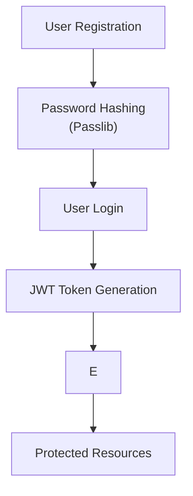

```mermaid
flowchart TD
    A["User Registration"]
    B["Password Hashing<br/>(Passlib)"]
    C["User Login"]
    D["JWT Token Generation"]
    F["Protected Resources"]

    A --> B
    B --> C
    C --> D
    D --> E
    E --> F
```
