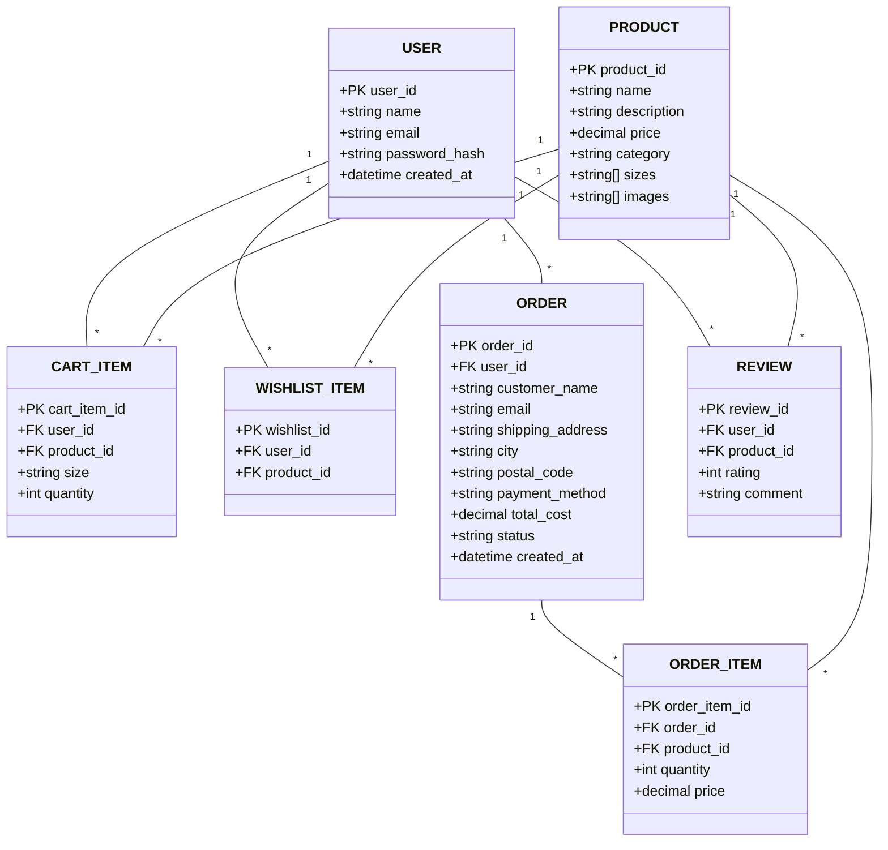

```mermaid
classDiagram
    direction TD

    class USER {
        +PK user_id
        +string name
        +string email
        +string password_hash
        +datetime created_at
    }

    class CART_ITEM {
        +PK cart_item_id
        +FK user_id
        +FK product_id
        +string size
        +int quantity
    }

    class PRODUCT {
        +PK product_id
        +string name
        +string description
        +decimal price
        +string category
        +string[] sizes
        +string[] images
    }

    class WISHLIST_ITEM {
        +PK wishlist_id
        +FK user_id
        +FK product_id
    }

    class ORDER {
        +PK order_id
        +FK user_id
        +string customer_name
        +string email
        +string shipping_address
        +string city
        +string postal_code
        +string payment_method
        +decimal total_cost
        +string status
        +datetime created_at
    }

    class REVIEW {
        +PK review_id
        +FK user_id
        +FK product_id
        +int rating
        +string comment
    }

    class ORDER_ITEM {
        +PK order_item_id
        +FK order_id
        +FK product_id
        +int quantity
        +decimal price
    }

    USER "1" -- "*" CART_ITEM
    PRODUCT "1" -- "*" CART_ITEM

    USER "1" -- "*" WISHLIST_ITEM
    PRODUCT "1" -- "*" WISHLIST_ITEM

    USER "1" -- "*" ORDER
    ORDER "1" -- "*" ORDER_ITEM
    PRODUCT "1" -- "*" ORDER_ITEM

    USER "1" -- "*" REVIEW
    PRODUCT "1" -- "*" REVIEW
```
