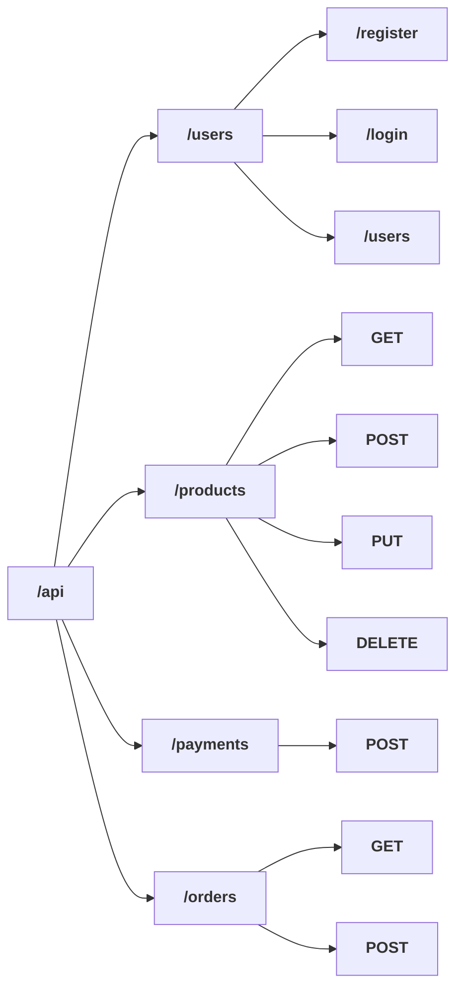

```mermaid
graph LR
    API["<b>/api</b>"]

    %% Users Branch
    API --> USERS["<b>/users</b>"]
    USERS --> REG["<b>/register</b>"]
    USERS --> LOG["<b>/login</b>"]
    USERS --> USR["<b>/users</b>"]

    %% Products Branch
    API --> PROD["<b>/products</b>"]
    PROD --> P_GET["<b>GET</b>"]
    PROD --> P_POST["<b>POST</b>"]
    PROD --> P_PUT["<b>PUT</b>"]
    PROD --> P_DEL["<b>DELETE</b>"]

    %% Payments Branch
    API --> PAY["<b>/payments</b>"]
    PAY --> PAY_POST["<b>POST</b>"]

    %% Orders Branch
    API --> ORD["<b>/orders</b>"]
    ORD --> O_GET["<b>GET</b>"]
    ORD --> O_POST["<b>POST</b>"]
```