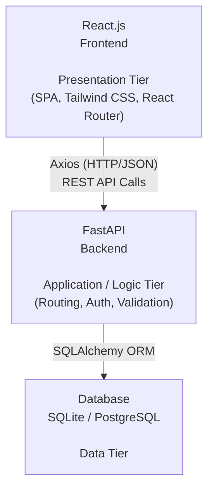

```mermaid 
flowchart TD
    A["React.js<br/>Frontend<br/><br/>Presentation Tier<br/>(SPA, Tailwind CSS, React Router)"]
    
    B["FastAPI<br/>Backend<br/><br/>Application / Logic Tier<br/>(Routing, Auth, Validation)"]
    
    C["Database<br/>SQLite / PostgreSQL<br/><br/>Data Tier"]

    A -->|"Axios (HTTP/JSON)<br/>REST API Calls"| B
    B -->|"SQLAlchemy ORM"| C

```